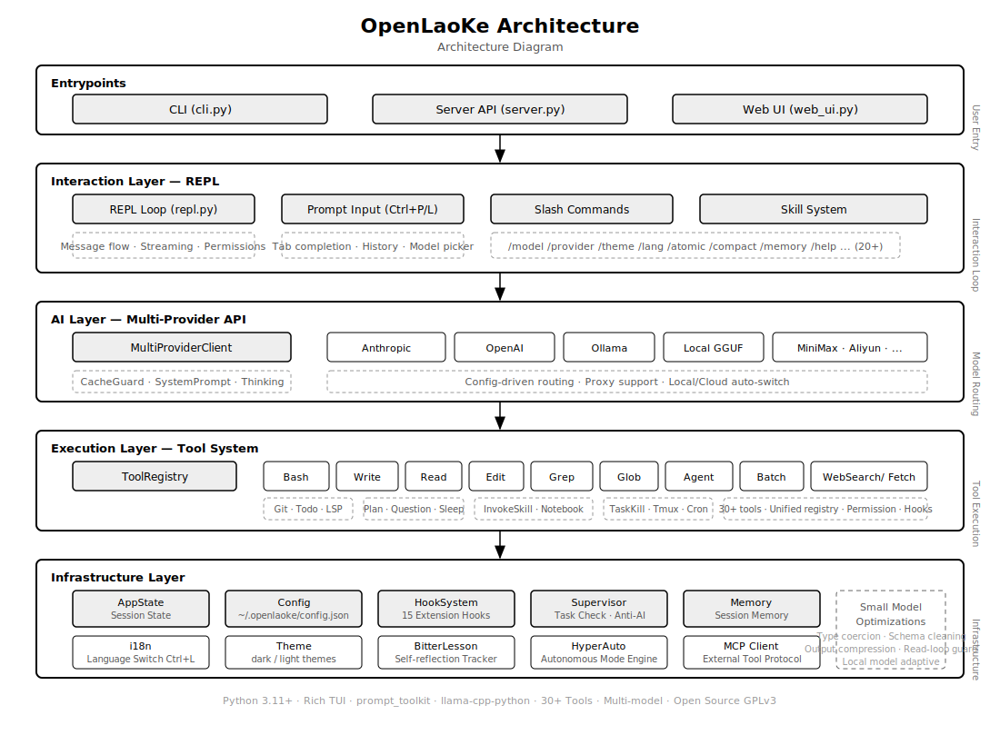

# OpenLaoKe

> Open-source terminal AI coding assistant with advanced automation, local model support, and intelligent supervision.

[](https://www.python.org/downloads/)
[](LICENSE)
[](https://github.com/astral-sh/ruff)

## Overview

OpenLaoKe is a terminal-based AI coding assistant that supports **24+ AI providers** and **local GGUF models** with zero API cost. Works with any model you choose — cloud API, local Ollama/LM Studio, or raw GGUF files.

## Quick Start

```bash
pip install openlaoke
openlaoke
```

## Key Features

- **Interactive REPL** — rich terminal UI, command history, smart autocomplete
- **Multi-Provider** — 24 cloud/local providers, any OpenAI-compatible endpoint
- **Local GGUF Models** — run any GGUF model locally via llama-cpp-python, zero API cost
- **Ctrl+P Model Picker** — instant provider/model switching overlay
- **30+ Tools** — Read, Write, Edit, Glob, Grep, Bash, LSP, Git, WebSearch, compound tools
- **MCP Support** — connect to external Model Context Protocol servers
- **Permission System** — default / auto / bypass modes
- **Session Persistence** — auto-save and resume conversations
- **Cost Tracking** — real-time token usage and cost display
- **20+ Slash Commands** — model switching, configuration, debugging
- **Hook System** — 15 extensible pre/post execution hooks
- **Proxy Support** — no proxy, system proxy, or custom proxy

### Advanced

- **HyperAuto** — fully autonomous mode with self-improvement
- **Task Supervision** — automatic retry, completion verification, quality checking
- **Model Assessment** — 5-tier adaptive task decomposition
- **Anti-AI Detection** — human-appearing content with real citations
- **Distilled Templates** — 79 Q&A templates across 31 categories, multi-language triggers
- **Skill System** — 27+ YAML-based skills for specialized workflows
- **Small Model Optimizations** — type coercion, schema sanitization, read-loop prevention, output compression
- **Fast Context Pruning** — pure-algorithm compression (<5ms, no LLM call)
- **Self-Reflection Tracker** — auto-disables failing strategies, learns from outcomes
- **Compound Tools** — ReadAndPatch, FindAndRead, SearchAndRead reduce sequential calls
- **Adaptive Router** — auto-promotes to stronger models on failure
- **Execution Traces** — record/replay agent turns with regression test generation

## Supported Providers

### Free
| Provider | Notes |
|----------|-------|
| **OpenCode Zen** | Completely free, no registration |

### Cloud
| Provider | Examples | API Key |
|----------|----------|---------|
| Anthropic | Claude Sonnet 4, Opus 4 | Yes |
| OpenAI | GPT-4o, o3, o4-mini | Yes |
| MiniMax | MiniMax-M2.7, M2.5 | Yes |
| Aliyun Coding Plan | Qwen3.5-plus, Kimi-k2.5, GLM-5 | Yes |
| Google AI | Gemini 2.5 Pro/Flash | Yes |
| AWS Bedrock | Claude, Llama, Nova | Yes |
| xAI | Grok-3 | Yes |
| Mistral | Mistral Large, Codestral | Yes |
| Groq | Llama 3.3 70B, Llama 4 | Yes |
| Cerebras | Llama 3.3 70B | Yes |
| Cohere | Command-r-plus | Yes |
| DeepInfra | Llama 3.3, Mistral | Yes |
| Together AI | Llama 3.3, Mistral | Yes |
| Perplexity | Sonar | Yes |
| OpenRouter | Multi-provider | Yes |
| GitHub Copilot | GPT-4o, o3 | Yes |

### Local
| Provider | Setup |
|----------|-------|
| Ollama | Install Ollama, run any model |
| LM Studio | Install LM Studio, run any model |
| GGUF (llama-cpp-python) | Any GGUF file, zero API cost |
| Custom OpenAI-Compatible | Any HTTP endpoint |

## Local GGUF Models

Run any GGUF model locally with [llama-cpp-python](https://github.com/abetlen/llama-cpp-python). No API key, no network required.

```bash
pip install openlaoke
# llama-cpp-python is auto-detected; install manually if needed:
pip install llama-cpp-python
```

### Download & Use Models

```bash
# Search ModelScope for any GGUF model
openlaoke model search llama

# Download a specific model
openlaoke model download unsloth/Llama-4-Scout-17B-16E-Instruct-GGUF

# List downloaded models
openlaoke model list

# Remove a model
openlaoke model remove custom:unsloth-Llama-4-Scout-17B-16E-Instruct-GGUF
```

### Configure

```bash
openlaoke --config
# Select "Built-in GGUF Model" → choose from downloaded models
```

Or edit `~/.openlaoke/config.json`:

```json
{
  "providers": {
    "active_provider": "local_builtin",
    "active_model": "custom:unsloth-Llama-4-Scout-17B-16E-Instruct-GGUF"
  }
}
```

### Local Parameters

| Parameter | Default | Description |
|-----------|---------|-------------|
| `n_ctx` | 262144 | Context window size |
| `temperature` | 0.3 | Lower = more deterministic |
| `repetition_penalty` | 1.1 | Reduces repetition loops |

```bash
# In REPL
/localconfig n_ctx 32768
/localconfig temperature 0.5
```

## Tools

### File Operations
Read, Write, Edit, Glob, Grep, LS

### Compound Tools
ReadAndPatch (read + edit in one call), FindAndRead (glob + read), SearchAndRead (grep + read)

### Code Intelligence
LSP, Git, Bash (streaming), CodeRunner (sandboxed)

### Web
WebSearch, WebFetch, WebBrowser (Playwright)

### Task Management
TodoWrite, TaskKill, Batch, Agent (sub-agents)

### Other
Notebook, Cron, Memory, REPL, Tmux, PowerShell

## Slash Commands

| Command | Description |
|---------|-------------|
| `/model <name>` | Switch model |
| `/provider <name>` | Switch provider |
| `/clear` | Clear conversation |
| `/compact` | Compact context |
| `/cost` | Show token usage & cost |
| `/thinking` | Show model reasoning |
| `/permission [mode]` | auto / default / bypass |
| `/theme [name]` | Change theme |
| `/hyperauto` | Autonomous mode |
| `/skill <name>` | Execute a skill |
| `/localconfig` | Configure local model |
| `/help` | All commands |

CLI model management:

```bash
openlaoke model download [id]   # Download GGUF from ModelScope
openlaoke model list             # List downloaded models
openlaoke model search <query>   # Search ModelScope
openlaoke model remove <id>      # Remove model
```

## Running Modes

```bash
openlaoke                              # Interactive TUI (default)
openlaoke --local                      # Local mode (atomic decomposition)
openlaoke web --host 0.0.0.0 --port 8080  # Web UI
openlaoke server                       # FastAPI backend (localhost:3000)
openlaoke "Write a Python script"      # Non-interactive
openlaoke --config                     # Configuration wizard
openlaoke --resume                     # Resume last session
```

## Skill System

27+ YAML-based skills loaded from `~/.config/opencode/skills/`:

| Skill | Description |
|-------|-------------|
| `/academic-writer` | Academic paper writing |
| `/an-jian` | Security audit for skills |
| `/ba-guan` | Pre-publish code review |
| `/brief-write` | Concise writing style |
| `/humanizer` | Humanize AI text |
| `/power-iterate` | Autonomous iteration |
| `/skill-refiner` | Improve skills |
| `/sleepless` | Non-stop execution |
| `/master-architect` | Architecture design |

## Architecture



## Configuration

`~/.openlaoke/config.json`:

```json
{
  "providers": {
    "active_provider": "ollama",
    "active_model": "llama3.2",
    "providers": {
      "ollama": {
        "base_url": "http://localhost:11434/v1",
        "default_model": "llama3.2",
        "enabled": true
      },
      "openai": {
        "api_key_env": "OPENAI_API_KEY",
        "default_model": "gpt-4o",
        "enabled": false
      }
    }
  },
  "proxy_mode": "none",
  "max_tokens": 8192,
  "theme": "dark"
}
```

## Environment Variables

| Variable | Provider |
|----------|----------|
| `ANTHROPIC_API_KEY` | Anthropic |
| `OPENAI_API_KEY` | OpenAI |
| `MINIMAX_API_KEY` | MiniMax |
| `ALIYUN_API_KEY` | Aliyun Coding Plan |
| `GOOGLE_API_KEY` | Google AI |
| `XAI_API_KEY` | xAI |
| `MISTRAL_API_KEY` | Mistral |
| `GROQ_API_KEY` | Groq |
| `CEREBRAS_API_KEY` | Cerebras |
| `COHERE_API_KEY` | Cohere |
| `DEEPINFRA_API_KEY` | DeepInfra |
| `TOGETHERAI_API_KEY` | Together AI |
| `PERPLEXITY_API_KEY` | Perplexity |
| `OPENROUTER_API_KEY` | OpenRouter |
| `GITHUB_TOKEN` | GitHub Copilot |
| `OPENLAOKE_MODEL` | Default model override |
| `HTTP_PROXY` / `HTTPS_PROXY` | Proxy |

## Development

```bash
pip install -e ".[dev]"
ruff check . && ruff format .
mypy
pytest
pytest --cov
```

## Acknowledgements

OpenLaoKe's architecture draws inspiration from several excellent open-source projects in the AI coding assistant space:

- **[nanobot](https://github.com/HKUDS/nanobot)** — for the event-driven agent loop, multi-channel session model, AutoCompact, and Dream memory consolidation patterns
- **[smallcode](https://github.com/Doorman11991/smallcode)** — for the liquid tool-call parser, tool routing with category scoring, thinking budget control, plan-tracker with step anchoring, and read-before-write guard
- **[DeepSeek-Reasonix](https://github.com/esengine/DeepSeek-Reasonix)** — for the transport-agnostic Controller pattern, cache-stable prefix with structured compaction, Previewer/PreviewChange tool interface, Config-driven provider/plugin registry, and plugin-based MCP client architecture
- **[OpenCode](https://github.com/opencode-ai/opencode)** — for the full-screen TUI design, git-native workflow, session fork/branch checkpoint model, and the pragmatic approach to zero-config multi-model routing

## License

GPLv3
